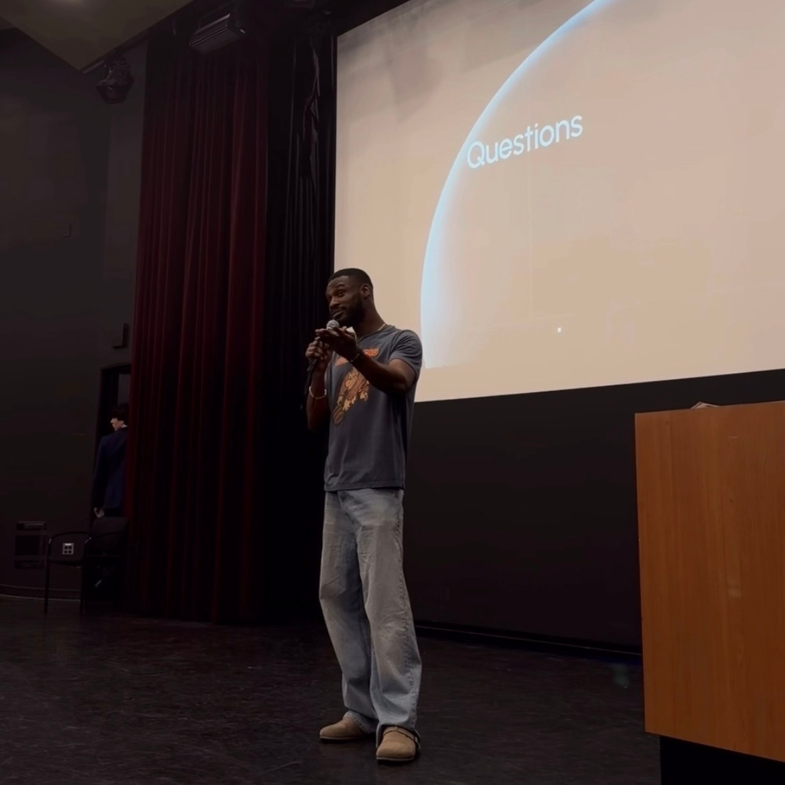
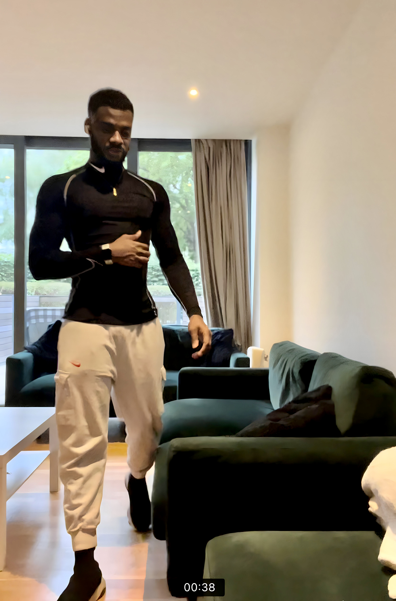

# Henry Ndubuaku

[![LinkedIn][linkedin-shield]][linkedin-url]
[![Twitter][twitter-shield]][twitter-url]
[![Email][gmail1-shield]][gmail1-url]
[![Spotify][spotify-shield]][spotify-url]

[gmail1-shield]: https://img.shields.io/badge/Gmail-555?style=for-the-badge&logo=gmail&logoColor=white
[gmail1-url]: ndubuakuhenry@gmail.com

[linkedin-shield]: https://img.shields.io/badge/-LinkedIn-black.svg?style=for-the-badge&logo=linkedin&colorB=555
[linkedin-url]: https://linkedin.com/in/henry-ndubuaku-7b6350b8

[twitter-shield]: https://img.shields.io/badge/Twitter-555?style=for-the-badge&logo=twitter&logoColor=white
[twitter-url]: https://twitter.com/hmunachii

[spotify-shield]: https://img.shields.io/badge/Spotify-555?style=for-the-badge&logo=spotify&logoColor=white
[spotify-url]: https://open.spotify.com/playlist/656vFNTyI2ZDsxgdQFaPHA?si=c2ff4aa84f6d42c4

  

Honestly, I'm a nobody, no pedigree, probably not whom labs like OpenAI, Meta, Anthropic would go after. 
I always dreamt of joining DeepMind, Waymo or Nvidia but never qualified as home student for PhD funding, stopped at MSc. 
Also, my research has always been proprietary, hard to prove how much I know. 

Nonetheless, I could train a 1B-A200m model on an iPhone 17 Pro at ~650 tokens/sec. 
It will take 360 days on 20B tokens of training data and use 156KW of electricity which cost $51. 
The phone will fry of course, so I wrote algorithms to run inference on your phone rather. 
We named it after a plant that survives in resource-constrained environments, the Cactus. 

 
can run similar model on your Grandma’s Pixel 6a at 80 tokens/second 
while only draining 10% battery per hour of continuous inference and using 250MB RAM only. 
Cactus runs Nvidia Parakeet 1B models on Raspberry Pi at over 17000 tokens/seconds with only 4% word-error-rate. 
End-to-end function calling for Gemma, Qwen & LFM models take sub 1sec on mobile devices. 

We raised some money from YCombinator, Oxford's Seed Fund, FCVC (portfolio include Slack, Coinbase, GitLab, Instacart etc.), 
and 6 smaller funds like Transpose (run by Garry Tan's brother), fellow YC founders, as well as 
62 tech CTOs/VP/Directors both via syndicate and directly at Google DeepMind etc. 

Cactus now powers cool products you've probably heard of...I think. 
6 exceptionally gifted "Cactus Jacks" from UCLA, Nokia, Google, Stanford, Oxford have joined us!
The project is also co-maintained by groups at UCLA, Yale, Upenn, Imperial, Georgia, NUS, UCI, CU Boulder
and UCI. 

Same destination, just a different route!

### Career

<table>
  <tr>
    <td><strong>Core Expertise</strong></td>
    <td>
      
      
      
      
      
    </td>
  </tr>
  <tr>
    <td><strong>Main Tools</strong></td>
    <td>
      
      
      
      
      
      
      
    </td>
  </tr>
</table>

<table>
  <tr>
    <td style="white-space:nowrap"><strong>2025-XX</strong></td>
    <td style="white-space:nowrap"><strong>Cactus (YC S25)</strong></td>
    <td style="white-space:nowrap">Founder & CTO</td>
    <td>Low-latency AI for phones and wearables</td>
  </tr>
  <tr>
    <td style="white-space:nowrap"><strong>2024-25</strong></td>
    <td style="white-space:nowrap"><strong>Deep Render</strong></td>
    <td style="white-space:nowrap">AI Research Engineer</td>
    <td>Realtime video models that run on phones</td>
  </tr>
  <tr>
    <td style="white-space:nowrap"><strong>2021-24</strong></td>
    <td style="white-space:nowrap"><strong>Wisdm</strong></td>
    <td style="white-space:nowrap">ML Software Engineer</td>
    <td>Perception AI for Maxar Defence satellite views</td>
  </tr>
  <tr>
    <td style="white-space:nowrap"><strong>2019-21</strong></td>
    <td style="white-space:nowrap"><strong>MSc + Open Source</strong></td>
    <td></td>
    <td>JAX/NanoDl, Torch/SuperLazyAutograd, CUDARepo, etc.</td>
  </tr>
  <tr>
    <td style="white-space:nowrap"><strong>2018-19</strong></td>
    <td style="white-space:nowrap"><strong>Google GADS + Andela</strong></td>
    <td style="white-space:nowrap">Scholar</td>
    <td>Systems design (pre-MSc)</td>
  </tr>
  <tr>
    <td style="white-space:nowrap"><strong>2017-18</strong></td>
    <td style="white-space:nowrap"><strong>National Youth Service</strong></td>
    <td style="white-space:nowrap">Software Engineer</td>
    <td>Posted after bootcamp, mostly ARM</td>
  </tr>
  <tr>
    <td style="white-space:nowrap"><strong>2012-16</strong></td>
    <td style="white-space:nowrap"><strong>University (from 15y)</strong></td>
    <td></td>
    <td>EECS, data structures, algorithms, maths, physics</td>
  </tr>
</table>

### Key Works

<table>
  <tr><td><a href="https://github.com/cactus-compute/cactus">Cactus: Kernels, graph and AI engine for phones & wearables (4.7k stars)</a></td></tr>
  <tr><td><a href="https://henryndubuaku.github.io/maths-cs-ai-compendium/">Maths, CS & AI Compendium (3.1k stars)</a></td></tr>
  <tr><td><a href="https://docs.cactuscompute.com/latest/blog/turboquant-h/">TurboQuant-H: Hadamard Rotation for 2-Bit Embedding Quantization</a></td></tr>
  <tr><td><a href="https://openreview.net/forum?id=I02VQSYShw&referrer=%5Bthe%20profile%20of%20Henry%20Ndubuaku%5D(%2Fprofile%3Fid%3D~Henry_Ndubuaku1)">HiDRA: A Blazing Fast LM-Head Replacement (ICLR 2026)</a></td></tr>
  <tr><td><a href="https://openreview.net/forum?id=rMrUJyrKHk">Depth Over Specialization in Small Multimodal Transformers (ICLR 2026)</a></td></tr>
  <tr><td><a href="https://openreview.net/forum?id=kKWSQsYgpa">Just Enough Learning: GRPO-Guided Controllers for Hyperparameter Sweeps (ICLR 2026)</a></td></tr>
  <tr><td><a href="https://openreview.net/forum?id=yUIOXlBYtP">TACE: Token-Aware Chunked Encoding For Realtime Speech Models (ICLR 2026)</a></td></tr>
</table>

### Fun Facts 

- After CUDARepo, Nvidia reached out, I did 7 technical rounds, got a verbal offer, back-and-forth over YOE/pay, then I got YC.
- Did MSc at QMUL, just to work with Prof Matt Purver (Ex-Stanford Researcher on CALO), did my project/thesis with his team.
- Did BEng under Prof Onyema Uzoamaka (Rumoured first Nigerian CS grad from MIT), he taught computing archs off-head!
- Biggest career miss was a PhD Studentship at Meta FAIR, recruiter went to vacation after onsite for weeks.

### Personal Life

<table>
  <tr>
    <td><strong>Profile</strong></td>
    <td>Nigerian/British, 30y, 185cm, 83kg, Capricorn</td>
  </tr>
  <tr>
    <td><strong>Language</strong></td>
    <td>English, Igbo, German (barely), French (yikes)</td>
  </tr>
  <tr>
    <td><strong>Hobbies</strong></td>
    <td>Calisthenics, UFC, chess, music, dance</td>
  </tr>
  <tr>
    <td><strong>Philosophy</strong></td>
    <td>Humanist Christian, unpolitical (your peace over my opinions)</td>
  </tr>
</table>

<table>
  <tr>
    <td align="center" width="33%">
       
      <em>Speaking at UCLA</em>
    </td>
    <td align="center" width="33%">
       
      <em>The Cactus Jacks</em>
    </td>
    <td align="center">
       
      <em>Team dinner</em>
    </td>
  </tr>
  <tr>
    <td align="center">
       
      <em>Calisthenics 6/7 days</em>
    </td>
    <td align="center">
       
      <em>Cactus Jacks at YC</em>
    </td>
    <td align="center">
       
      <em>Cactus Pod at YC HQ</em>
    </td>
  </tr>
</table>

### Music Profile

<table>
  <tr>
    <td><strong>Expressive Rap</strong></td>
    <td>
      
      
      
      
    </td>
  </tr>
  <tr>
    <td><strong>Alternative/Folk</strong></td>
    <td>
      
      
      
      
    </td>
  </tr>
  <tr>
    <td><strong>Soul/Jazz</strong></td>
    <td>
      
      
      
      
    </td>
  </tr>
  <tr>
    <td><strong>Oldies</strong></td>
    <td>
      
      
      
    </td>
  </tr>
  <tr>
    <td><strong>Genre-Blending Urban</strong></td>
    <td>
      
      
      
      
    </td>
  </tr>
  <tr>
    <td><strong>Dark Pop</strong></td>
    <td>
      
      
      
      
    </td>
  </tr>
</table>
  
### Movie Profile

<table>
  <tr>
    <td><strong>Animation</strong></td>
    <td>
      
    </td>
  </tr>
  <tr>
    <td><strong>Drama</strong></td>
    <td>
      
      
    </td>
  </tr>
  <tr>
    <td><strong>Comedy</strong></td>
    <td>
      
      
      
    </td>
  </tr>
</table>
